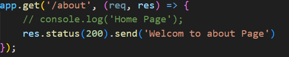
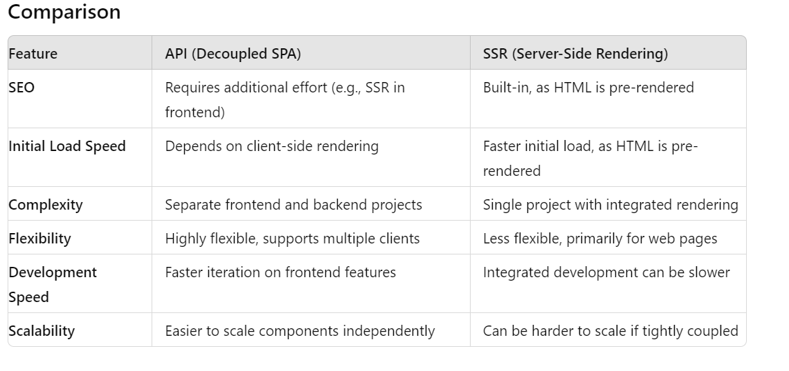
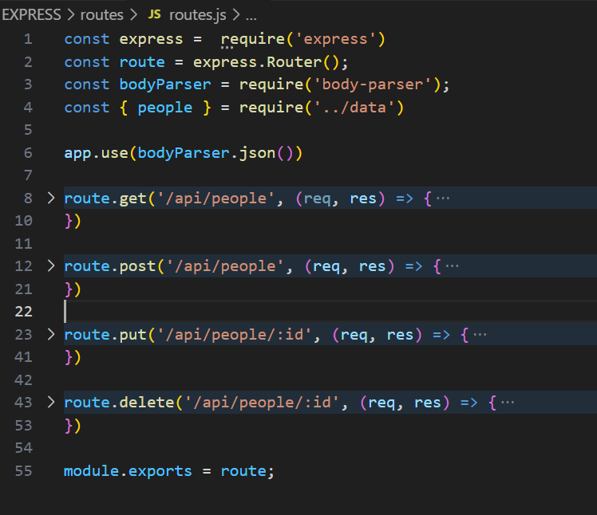
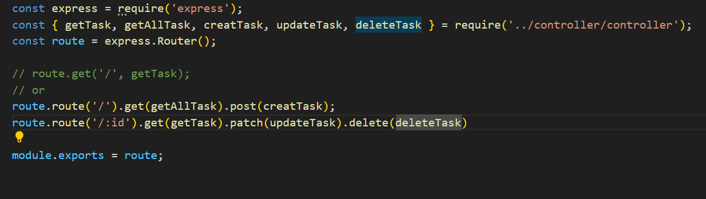

REPO - https://github.com/john-smilga/node-express-course
https://github.com/StephenGrider/AdvancedNodeComplete

<!-- #Importants -->

global - no window
__dirname = path of current directory
__filename = file name
require =  function to use module(commonjs)
module = information about current module(file)
process  = info about env wher the program being execute

<!-- #module -->
module.exports.fruits = ['Apple', 'Banana', 'Orange', 'Mango'];

const data = {
  name: 'Jone Data',
};

module.exports.singalPerson = data.name;

# module path
how to get base name path
const pathJoin = path.join('/context', 'pathtest', 'text.txt')
console.log('Path : ', pathJoin);
console.log('BaseName', path.basename(pathJoin));

- get absolut path
const absolutPath =  path.resolve(__dirname, 'context', 'pathtest', 'text.txt' );
console.log('absolutPath : ', absolutPath) 

# module fs

- read file and readFile
const readFirstFile =  readFileSync('./fs/fsOne.txt', 'utf-8')
- write file
const writeFile =  writeFileSync('./fs/write.txt', 'Hello pass data2 mode World', {flag : 'a'});
Here flag is define to start and just like push our content..

# Http Modle

These are helpfull for request server and server will respond then user can get data
- we are creating server 
- handling req, res of url
- HTTP/http.js
- created server listen port

> HTTP METHODS

- GET - Read data
- Post - Inser Data
- Put - Update Data
- Delete - Delete Data

GET - Get all orders
POST - Insert and Placed on Orders
PUT - Update on behalf of specific id

# npm 
- it's called re-useable pakages that containts of js code.
- Another name called modules and dependancy
- npm is global command comes with nodejs
- local dependancy - use in particular project [NPM i]
- global dependancy - use it any project [npm i -g]

# Deploymet Platform
- digitalocean, horrocu

# Event loop 
 - it to handle asynchronous operations
 - It is the mechanism that allows Node.js to perform non-blocking I/O operations 
 - Node.js uses the event loop to handle asynchronous operations without blocking the main thread.
  > Event Loop is working in phase wise
  - TIME PHASE - Executes callbacks scheduled by setTimeout and setInterval.
  - PENDING CALLBACK PHASE - Executes I/O callbacks deferred to the next loop iteration.
  - Idle, Prepare Phase: Used internally by Node.js for internal operations.
  - Poll Phase: Retrieves new I/O events; executes I/O-related callbacks (excluding close callbacks, timers, and setImmediate).
  - Check Phase: 
  - Close Callbacks Phase:Executes close event callbacks (e.g., socket.on('close', ...)).

  > Task Queue and Microtask Queue:
  - Task Queue (Macro-tasks): Includes callbacks from setTimeout, setInterval, setImmediate, I/O, and others.
  - Microtask Queue: Includes promises and process.nextTick.

  > Order of Execution:
  - Microtasks are executed after each phase of the event loop.

Reff - https://nodejs.org/en/learn/asynchronous-work/event-loop-timers-and-nexttick

# EXPRESSJS

- it's kind of famework of nodejs
> Performance

-  Express provides a thin layer of fundamental web application features, without obscuring Node.js features that you know and love.

> Middleware
- Express is a lightweight and flexible routing framework with minimal core features meant to be augmented through the use of Express middleware modules.

> Web Applications
- Express is a minimal and flexible Node.js web application framework that provides a robust set of features for web and mobile applications.

> APIs
- With a myriad of HTTP utility methods and middleware at your disposal, creating a robust API is quick and easy.

> Methods
 >  app.get
   - In express method is res.send('msg)
   - it will take two argument app.get(path, callback Fn)
   - app.get('/', (req, res) => {
      res.sendFile(path.join(__dirname, "./navBar/index.html"))
      })

      reff - showNav.js
  - sendFile is use for redirect path
  - HOW TO show data.js file in json format reff -  dataJsonUi.js
  - json Data Show on ui after button click with a tag link 
  reff - conditionaldatShowUIJson.js
  - ROUTING PARAMS AND USING product id on url and show data
  reff - parmsRouting.js

  > Query String Perameters and URL Peramtrs
    - we have url - http://localhost:5000/api/query?name=JohnDoe&age=25&city=NewYork
    - 
 - app.put
 - app.push
 - app.delet
> app.all
 - You can use app.all to apply middleware that needs to run for every request to a specific path, such as authentication, logging, or setting response headers.

 - app.all('/user', (req, res, next) => {
  console.log('A request was made to /user');
  next(); // Pass control to the next handler.

  - 
  - Status and Send 
  
});
> app.use 
 - It,s responsible for Middleware
> app.listen
 - Responsible for port configure

 > API VS SSR

 

 # Middleware
 - it's a function that request to the servr 
 - express is based on bunch of middleware
 - when you work with middleware must be pass next() if not then browser will be not loded
 - all kind of logic we can setup in middleware
 - two case here either u pass next() else trminate funtion like as res.send('msg')
 - app.use('path will apply on all router', exprted function)
 ref - middleWareBasic.js
 - // for multiple middlewareval.js and middlewareBasic.js
    app.use([getHome, authrise])

 Q// How we pass two middleware in single route
 Ans - app.get('/about',[getHome, authrise], (req, res) =>{
    console.log('User : ', req.user);
    res.send('About')
})

Q// can we creat own middleware/ Express/ third-party

 - Yes We can creat Own Middleware app.use(//logic)
 - Express Also app.use(express.static('path'))
 - Third Party morgan npm reff - https://expressjs.com/en/resources/middleware/morgan.html
 
 Q// creat form and use post method
 - such cases i will use app.use(express.urlencoded({extended: false})) for get request data from body parser then we can able to show req.body data
 - ref - 

 # Install Postman
 - use for test API 

  1. use postman display some get data
   - reff data use (data.js/product)
   - Ans - Express / Postman/get.js

  2. in post cenerion need to be use
    - const bodyParser = require('body-parser');
    - // Middleware to parse JSON bodies  app.use(bodyParser.json());
    - Ans - Express / Postman/post.js
  
  3. Put req
   - for put required parms (for url id)
   - req body for update responce
   - Ans Reff -  Ans - Express / Postman/post.js

# route
 - inside Express folder
 - base url need to be common
 - 
 - need to be use route.use(bodyParser.json()) middle ware
 - we are using kind of clear code of app.js
 - importing like as
 - app.use('/api/people', peopleRoute) [app.js] base rout and route import path
 - 

# controller
 - for cleanig router using controler

 --------------------------------------------------------------------------------------------
 # TASK MENAGER API SESSION

 > Install dependancy
  -  "dependencies": {
    "dotenv": "^16.4.5", 
    "express": "^4.19.2",
    "mongoose": "^8.4.1"
    }

  - devdependancy nodemon

> MONGODB
 -  NOSQL NON-relation DB
 - Store Db in json
 - Easy to get started
 - Free cloud hosting - ATLAS

1. https://cloud.mongodb.com/v2/65894a504b1f084cbe22aa55#/security/database/users
> Database Access
- step -1 : Database Acess > Add New Database User > Password > 
  Built-in Role {selecte - Read and write} > Add User

> Network Access
 - Ip AcessList > Add Ip Adress >  confirm > 

> Cluster
- Databas > cluster > connect[click]
- Connecting with MongoDB Driver >  nodejs > latest version >
mongodb+srv://<username>:<password>@mern-project.d94v79r.mongodb.net/?retryWrites=true&w=majority&appName=mern-project
- collection > Add my own data > Create Database > db name > collection name > ok 

> # What's MVC pattern
- In Node.js, the Model-View-Controller (MVC) pattern is a design pattern used to structure applications in a way that separates concerns, making the codebase more organized, maintainable, and scalable
# Modal
- The model represents the data and the business logic of the application
- it typically interacts with the database .
- models are often implemented using modules or classes that define data schemas, perform CRUD operations (Create, Read, Update, Delete), and encapsulate business logic.

# View
- The view is responsible for presenting data to the user and receiving user input.
- Node.js application, views are usually implemented using template engines like EJS, Pug

# Controller
-  The controller acts as an intermediary between the model and the view
-  Controllers in Node.js are typically implemented as modules or classes that handle HTTP requests, route them to the appropriate handlers.

> # MONGOOSE
- doc for crud operation - https://mongoosejs.com/docs/queries.html
- 

:::::::::::::::::::Start::::::::

> 🧩 Basic Node.js Questions

| #  | Question                                                       | Key Point / Hint                                                     |
| -- | -------------------------------------------------------------- | -------------------------------------------------------------------- |
| 1  | What is Node.js?                                               | Runtime built on Chrome’s V8 engine; executes JS on server.          |
| 2  | Is Node single-threaded?                                       | Yes — uses event loop + worker pool for async tasks.                 |
| 3  | What is the difference between Node.js and JavaScript?         | JS = language; Node = runtime for server-side JS.                    |
| 4  | What is `npm`?                                                 | Node Package Manager — handles dependencies.                         |
| 5  | What is `package.json` used for?                               | Metadata, scripts, dependency list.                                  |
| 6  | What are callbacks in Node.js?                                 | Functions executed after an async operation completes.               |
| 7  | What is the Event Loop?                                        | Core mechanism that handles async operations in a single thread.     |
| 8  | What is the difference between blocking and non-blocking code? | Blocking halts the event loop; non-blocking uses callbacks/promises. |
| 9  | What is the purpose of `require()`?                            | Imports modules. (CommonJS format)                                   |
| 10 | How do you handle errors in Node.js?                           | `try...catch`, `.catch()` in Promises, `error` events.               |

> ⚙️ Intermediate-Level Questions

| #  | Question                                                                  | Key Point / Hint                                                            |
| -- | ------------------------------------------------------------------------- | --------------------------------------------------------------------------- |
| 11 | Explain Streams in Node.js                                                | Handle large data in chunks — types: Readable, Writable, Duplex, Transform. |
| 12 | What is Buffer in Node.js?                                                | Used to handle binary data (e.g., file I/O, network streams).               |
| 13 | What is Middleware in Node.js/Express?                                    | Functions that modify request/response objects.                             |
| 14 | What is the difference between `process.nextTick()` and `setImmediate()`? | `nextTick()` runs before next event loop phase; `setImmediate()` after.     |
| 15 | What is the use of `cluster` module?                                      | Enables multi-core utilization (forks multiple processes).                  |
| 16 | How does Node handle child processes?                                     | Using `child_process` module (`spawn`, `exec`, `fork`).                     |
| 17 | What is the difference between `fs.readFile` and `fs.createReadStream`?   | `readFile` reads whole file → memory; `createReadStream` streams chunks.    |
| 18 | What are environment variables?                                           | Configuration values stored outside source code (via `process.env`).        |
| 19 | What is CORS and how do you enable it?                                    | Cross-Origin Resource Sharing; use middleware like `cors()` in Express.     |
| 20 | What is the difference between `exports` and `module.exports`?            | `exports` is a shorthand; both reference same object initially.             |

>  🧠 Advanced / Real-World Questions

| #  | Question                                                   | Key Point / Hint                                                 |
| -- | ---------------------------------------------------------- | ---------------------------------------------------------------- |
| 21 | How does Node handle concurrency with a single thread?     | Event loop + async I/O + worker threads for heavy tasks.         |
| 22 | Explain the phases of the Event Loop.                      | Timers → Pending callbacks → Poll → Check → Close callbacks.     |
| 23 | What are Worker Threads in Node.js?                        | Allow multi-threading for CPU-intensive tasks.                   |
| 24 | What is the difference between `process` and `os` modules? | `process` = runtime info; `os` = system-level info.              |
| 25 | How do you secure a Node.js application?                   | Helmet, rate limiting, sanitization, HTTPS, JWT validation.      |
| 26 | How to manage sessions and authentication in Node?         | Cookies, JWT, or `express-session`.                              |
| 27 | Explain the difference between `async/await` and Promises. | `await` simplifies Promise chaining (syntactic sugar).           |
| 28 | What is event-driven architecture?                         | System where events trigger async handlers (core of Node).       |
| 29 | How to optimize performance in Node.js?                    | Use clustering, caching, load balancing, async I/O, compression. |
| 30 | How to handle unhandled promise rejections?                | Use `.catch()`, `process.on('unhandledRejection')`.              |

> 🚀 Real-World / Project-Level Questions

| #  | Question                                                               | Hint / Example                                                                      |
| -- | ---------------------------------------------------------------------- | ----------------------------------------------------------------------------------- |
| 31 | How do you connect Node.js with databases (e.g., MongoDB, PostgreSQL)? | `mongoose`, `pg`, or ORM like `Sequelize` / `Knex`.                                 |
| 32 | How do you structure a scalable Node project?                          | Modular routes, services, controllers, config, middlewares.                         |
| 33 | How do you handle large file uploads?                                  | Use `multer`, `busboy`, or stream directly.                                         |
| 34 | What is rate limiting and why is it important?                         | Prevents API abuse; use `express-rate-limit`.                                       |
| 35 | What is load balancing in Node.js?                                     | Distribute requests across multiple instances (via `cluster`, Nginx, or AWS).       |
| 36 | What is JWT and how do you use it in Node.js?                          | JSON Web Token for stateless authentication.                                        |
| 37 | How do you debug Node.js applications?                                 | `console.log`, Chrome DevTools, or `node --inspect`.                                |
| 38 | How do you handle async errors globally in Express?                    | Custom error middleware or wrapper functions.                                       |
| 39 | What are the benefits of using Knex.js or Prisma ORM?                  | Query builder, migration support, DB-agnostic.                                      |
| 40 | What are the latest features in Node.js (v18+)?                        | Built-in `fetch`, native test runner, ES Modules support, global `AbortController`. |
 
::::::::::::::::END:::::::::::::::::::::::::::::::::::::::

