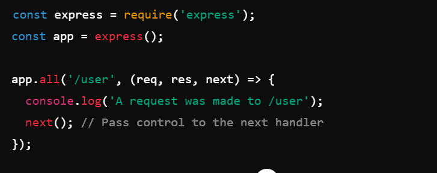

REPO - https://github.com/john-smilga/node-express-course

<!-- #Importants -->

global - no window
__dirname = path of current directory
__filename = file name
require =  function to use module(commonjs)
module = information about current module(file)
process  = info about env wher the program being execute

<!-- #module -->
module.exports.fruits = ['Apple', 'Banana', 'Orange', 'Mango'];

const data = {
  name: 'Jone Data',
};

module.exports.singalPerson = data.name;

# module path
how to get base name path
const pathJoin = path.join('/context', 'pathtest', 'text.txt')
console.log('Path : ', pathJoin);
console.log('BaseName', path.basename(pathJoin));

- get absolut path
const absolutPath =  path.resolve(__dirname, 'context', 'pathtest', 'text.txt' );
console.log('absolutPath : ', absolutPath) 

# module fs

- read file and readFile
const readFirstFile =  readFileSync('./fs/fsOne.txt', 'utf-8')
- write file
const writeFile =  writeFileSync('./fs/write.txt', 'Hello pass data2 mode World', {flag : 'a'});
Here flag is define to start and just like push our content..

# Http Modle

These are helpfull for request server and server will respond then user can get data
- we are creating server 
- handling req, res of url
- HTTP/http.js
- created server listen port

> HTTP METHODS

- GET - Read data
- Post - Inser Data
- Put - Update Data
- Delete - Delete Data

GET - Get all orders
POST - Insert and Placed on Orders
PUT - Update on behalf of specific id

# npm 
- it's called re-useable pakages that containts of js code.
- Another name called modules and dependancy
- npm is global command comes with nodejs
- local dependancy - use in particular project [NPM i]
- global dependancy - use it any project [npm i -g]

# Deploymet Platform
- digitalocean, horrocu

# Event loop 
 - it to handle asynchronous operations
 - It is the mechanism that allows Node.js to perform non-blocking I/O operations 
 - Node.js uses the event loop to handle asynchronous operations without blocking the main thread.
  > Event Loop is working in phase wise
  - TIME PHASE - Executes callbacks scheduled by setTimeout and setInterval.
  - PENDING CALLBACK PHASE - Executes I/O callbacks deferred to the next loop iteration.
  - Idle, Prepare Phase: Used internally by Node.js for internal operations.
  - Poll Phase: Retrieves new I/O events; executes I/O-related callbacks (excluding close callbacks, timers, and setImmediate).
  - Check Phase: 
  - Close Callbacks Phase:Executes close event callbacks (e.g., socket.on('close', ...)).

  > Task Queue and Microtask Queue:
  - Task Queue (Macro-tasks): Includes callbacks from setTimeout, setInterval, setImmediate, I/O, and others.
  - Microtask Queue: Includes promises and process.nextTick.

  > Order of Execution:
  - Microtasks are executed after each phase of the event loop.

Reff - https://nodejs.org/en/learn/asynchronous-work/event-loop-timers-and-nexttick

# EXPRESSJS

- it's kind of famework of nodejs
> Performance

-  Express provides a thin layer of fundamental web application features, without obscuring Node.js features that you know and love.

> Middleware
- Express is a lightweight and flexible routing framework with minimal core features meant to be augmented through the use of Express middleware modules.

> Web Applications
- Express is a minimal and flexible Node.js web application framework that provides a robust set of features for web and mobile applications.

> APIs
- With a myriad of HTTP utility methods and middleware at your disposal, creating a robust API is quick and easy.

> Methods
 >  app.get
   - In express method is res.send('msg)
   - it will take two argument app.get(path, callback Fn)

 - app.put
 - app.push
 - app.delet
> app.all
 - You can use app.all to apply middleware that needs to run for every request to a specific path, such as authentication, logging, or setting response headers.

 - app.all('/user', (req, res, next) => {
  console.log('A request was made to /user');
  next(); // Pass control to the next handler
  <!-- - [] -->
  - 
});
> app.use 
 - It,s responsible for Middleware
> app.listen
 - Responsible for port configure